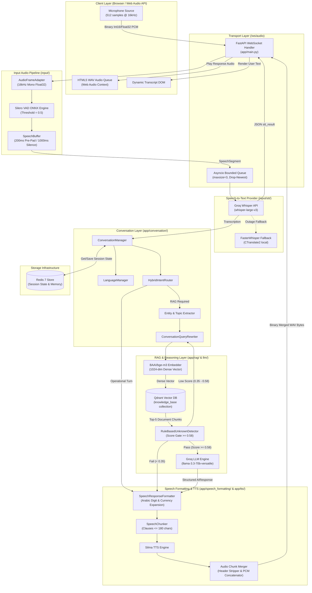
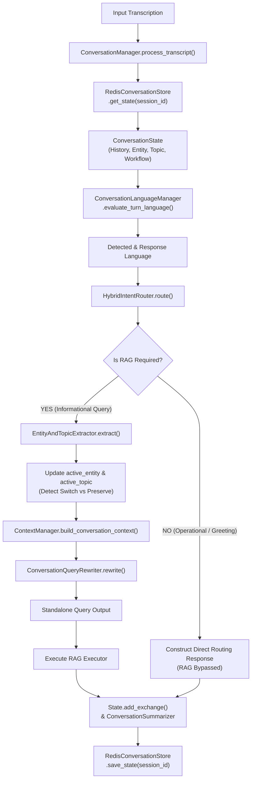
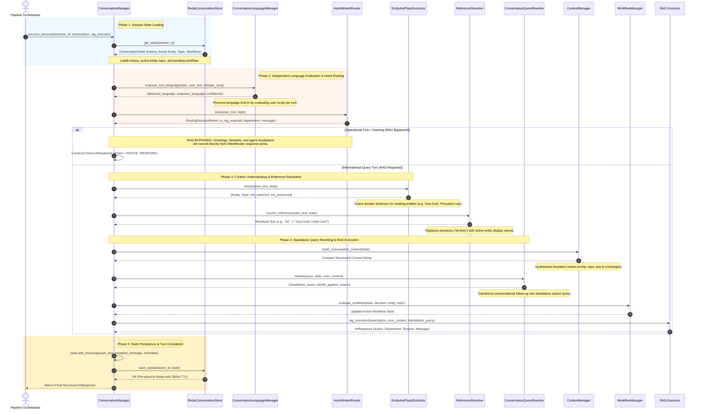
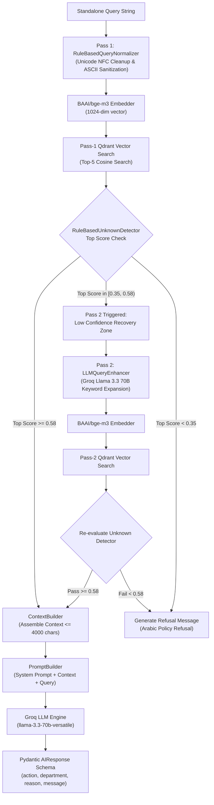
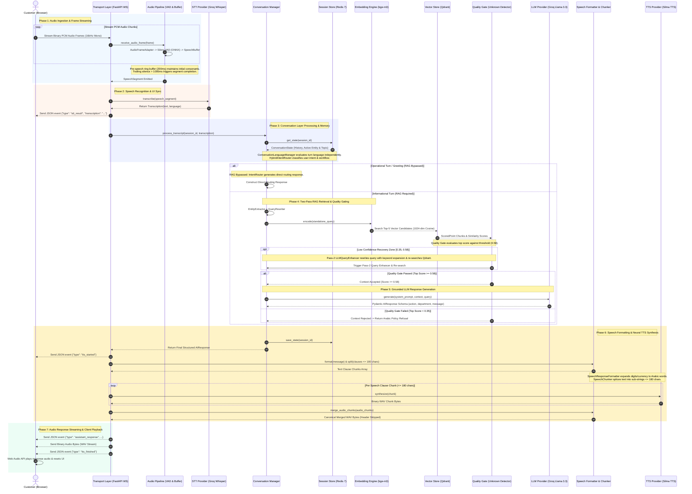

# System Architecture & Technical Design Documentation
## Multilingual Voice AI Customer Service Assistant — Banque Misr

---

## Executive Summary & TL;DR

### System Purpose
An enterprise-grade, real-time, multilingual (Egyptian Arabic & English) **Voice AI Customer Service Assistant** designed for Banque Misr domain inquiries (e.g., credit cards, loans, mobile banking, accounts). It provides sub-2-second latency voice conversations using binary WebAudio streaming over WebSockets, low-latency Speech-to-Text, context-aware intent routing and conversation state tracking, hallucination-free two-pass RAG retrieval, and natural dialectal Arabic text-to-speech synthesis.

### Pipeline Overview
```
Browser Microphone (PCM Audio)
     ↓
WebSocket Transport (/ws/audio)
     ↓
Audio Adapter & Silero VAD (ONNX)
     ↓
Speech Buffer (Silence Endpointing)
     ↓
Speech-to-Text Provider (Groq Whisper)
     ↓
Conversation Layer (State, Intent Routing, Entity & Topic, Query Rewriting)
     ↓
RAG & Reasoning Engine (BAAI/bge-m3 Embeddings + Qdrant Vector DB + Quality Gate)
     ↓
LLM Inference Provider (Groq Llama 3.3 70B)
     ↓
Speech Formatting & Clause Chunking
     ↓
Text-to-Speech Provider (Silma TTS)
     ↓
Audio Buffer Concatenation (Header Stripping)
     ↓
Browser Audio Playback
```

---

## 1. Logical Software Architecture

The architecture decouples **logical interface abstractions** from **concrete technology implementations**. This guarantees vendor-neutral flexibility, enabling STT, LLM, TTS, or Vector Store providers to be swapped via configuration without modifying business logic.

```
+-----------------------------------------------------------------------------------+
|                                  CLIENT LAYER                                     |
|                       (Web Audio API / Binary WS Client)                          |
+-----------------------------------------------------------------------------------+
                                          |
                                          | WebSocket (Binary PCM / JSON Events)
                                          v
+-----------------------------------------------------------------------------------+
|                                 TRANSPORT LAYER                                   |
|                          (FastAPI Endpoint Router)                                |
+-----------------------------------------------------------------------------------+
                                          |
                                          v
+-----------------------------------------------------------------------------------+
|                                 AUDIO PIPELINE                                    |
|          [Audio Adapter] -> [VAD Engine] -> [Speech Segment Buffer]               |
+-----------------------------------------------------------------------------------+
                                          |
                                          v
+-----------------------------------------------------------------------------------+
|                              SPEECH-TO-TEXT LAYER                                 |
|                       (Abstract SpeechRecognizer Interface)                       |
+-----------------------------------------------------------------------------------+
                                          |
                                          v
+-----------------------------------------------------------------------------------+
|                               CONVERSATION LAYER                                  |
|   [Session Store] -> [Language Engine] -> [Intent Router] -> [Entity & Topic]     |
|                                           |                                       |
|                                           v                                       |
|                              [Query Rewriter / Policy Engine]                     |
+-----------------------------------------------------------------------------------+
                     |                                       |
  (Operational Turn / RAG Bypassed)              (Informational Query / RAG Required)
                     |                                       |
                     v                                       v
+------------------------------------+    +-----------------------------------------+
|     DIRECT RESPONSE GENERATION     |    |           RAG & REASONING LAYER         |
|  (Intent Router Pool / Workflows)  |    |  [Embedding Engine] -> [Vector Store]   |
+------------------------------------+    |                   |                     |
                     |                    |                   v                     |
                     |                    |     [Quality Gate / Detector]           |
                     |                    |                   |                     |
                     |                    |                   v                     |
                     |                    |            [LLM Provider]               |
                     |                    +-----------------------------------------+
                     \                                       /
                      -------------------\ /-----------------
                                          v
+-----------------------------------------------------------------------------------+
|                            SPEECH FORMATTING & TTS LAYER                          |
|         [Text Formatter] -> [Clause Chunker] -> [TTS Synthesizer Provider]        |
|                                          |                                        |
|                             [Audio Chunk Concatenator]                            |
+-----------------------------------------------------------------------------------+
                                          |
                                          v
+-----------------------------------------------------------------------------------+
|                                  STORAGE LAYER                                    |
|         [Redis Session State & Memory]  |  [Qdrant Vector Knowledge Base]         |
+-----------------------------------------------------------------------------------+
```

### Logical Component Definitions

| Logical Component | Abstract Interface / Contract | Primary Responsibility |
|---|---|---|
| **Transport Layer** | `FastAPI WebSocket Handler` | Manages persistent bi-directional connection, framing, and event serialization. |
| **Audio Adapter** | `AudioFrameAdapter` | Converts multi-format incoming raw PCM bytes into normalized float32 single-channel 16kHz audio. |
| **VAD Engine** | `VoiceActivityDetector` | Frame-level deep-learning speech detection and probability calculation. |
| **Speech Buffer** | `SpeechBuffer` | Maintains pre-speech padding ring buffer and trailing silence speech segment boundary detection. |
| **STT Provider** | `SpeechRecognizer` | Asynchronously converts audio PCM bytes into structured transcription text and language metadata. |
| **Session Memory Store** | `ConversationStore` | Persists multi-turn conversation state, history, entities, and topics. |
| **Language Evaluator** | `LanguageManager` | Determines utterance language independently per turn (Egyptian Arabic, Standard Arabic, English). |
| **Intent Router** | `IntentRouter` | Classifies user intent (Greeting, Escalation, Inquiry, Out-of-Scope) and decides if RAG is required. |
| **Entity & Topic Extractor** | `EntityTopicExtractor` | Extracts active banking products, accounts, and discussion topics across turns. |
| **Query Rewriter** | `QueryRewriter` | Resolves coreferences and generates standalone search queries for multi-turn context retrieval. |
| **Embedding Provider** | `EmbeddingService` | Maps text strings into dense floating-point vector space representations. |
| **Vector Database** | `VectorStore` | Executes Approximate Nearest Neighbor (ANN) vector similarity searches over knowledge collections. |
| **Quality Gate** | `UnknownAnswerDetector` | Evaluates vector similarity scores to detect out-of-knowledge queries and prevent hallucinations. |
| **LLM Provider** | `LanguageModel` | Generates structured, deterministic customer service responses grounded on retrieved context. |
| **Speech Formatter** | `SpeechResponseFormatter` | Cleans Markdown, expands numeric digits, currencies, and abbreviations into spoken Arabic words. |
| **Speech Chunker** | `SpeechChunker` | Splices long text responses into clause-aligned strings ($\le 180$ chars) optimized for TTS synthesis. |
| **TTS Provider** | `SpeechSynthesizer` | Synthesizes text clauses into binary WAV audio frames. |
| **Audio Merger** | `merge_audio_chunks` | Strips intermediate WAV headers and recalculates single canonical WAV header over concatenated PCM. |

---

## 2. Current Implementation Bindings

This section details the concrete, active technology stack powering the current production environment.

| Logical Architecture Layer | Active Concrete Technology | Configuration Details / Version |
|---|---|---|
| **Application & Transport** | FastAPI 0.115+ / Uvicorn | Async WebSockets (`/ws/audio`), Web Audio API, NumPy 2.x |
| **Audio Framing & VAD** | Silero VAD v5 (ONNX Runtime) | 16kHz Mono Float32, `threshold = 0.5`, 32ms frames |
| **Speech Segment Buffer** | Custom `SpeechBuffer` | `pre_speech_padding_ms = 200`, `max_silence_duration_ms = 1000` |
| **Speech-to-Text (STT)** | Groq Whisper API | Primary: `whisper-large-v3` via Groq; Fallback: `FasterWhisper` (CTranslate2) |
| **Session Memory Store** | Redis 7 | Async `redis-py`, JSON state serialization, 3600s TTL |
| **Conversation Orchestrator**| `ConversationManager v2` | Stateful intent routing, entity tracking, query rewriter engine |
| **Embedding Engine** | `BAAI/bge-m3` | 1024-dimensional dense vectors loaded via `SentenceTransformers` |
| **Vector Database** | Qdrant v1.15.3 | Collection: `knowledge_base`, Cosine similarity, Top-K = 5 |
| **LLM Engine** | Groq API (`llama-3.3-70b-versatile`) | Pydantic structured output `AIResponse`, Temperature: `0.1` |
| **Speech Normalization** | Custom Regex Formatter | Arabic digit-to-words expansion, Markdown stripper, EGP token converter |
| **Text-to-Speech (TTS)** | Silma TTS API | Arabic dialectal neural TTS, HTTP POST JSON synthesis endpoint |

---

## 3. High-Level Architecture & Component Diagrams

### Diagram 1: High-Level System Architecture



---

### Diagram 2: Conversation Layer Architecture



---

### Diagram 2.1: Conversation Layer Runtime Sequence



---

## 2.1 Conversation Layer Lifecycle & Component Deep-Dive

The **Conversation Layer** is the cognitive control center of the Voice AI Assistant. Operating between STT transcription and RAG vector search, it manages session memory, evaluates turn language independently, routes user intent, resolves entity coreferences, rewrites follow-up questions, and enforces dialogue workflows.

```
[STT Transcription] ──> [ConversationManager]
                             │
                             ├──> 1. RedisConversationStore (Load State)
                             ├──> 2. ConversationLanguageManager (Evaluate Language)
                             ├──> 3. HybridIntentRouter (Classify Intent & RAG Bypass)
                             ├──> 4. EntityAndTopicExtractor (Extract Product & Topic)
                             ├──> 5. ReferenceResolver (Resolve Pronouns)
                             ├──> 6. ContextManager (Build Compact Context)
                             ├──> 7. ConversationQueryRewriter (Generate Standalone Query)
                             ├──> 8. WorkflowManager (Update Workflow State)
                             └──> 9. RedisConversationStore (Save State)
```

### 1. Redis Conversation Store (`RedisConversationStore`)
- **Purpose:** Manages asynchronous persistence and retrieval of `ConversationState` objects from Redis 7.
- **Input:** `session_id: str` or `(session_id: str, state: ConversationState)`.
- **Output:** `ConversationState` model instance.
- **Why it exists:** Provides stateful dialogue memory across stateless WebSocket connections without thread-blocking disk I/O.
- **Execution Order Rationale:** Must run **first** in the turn sequence to hydrate history before any cognitive evaluation occurs, and **last** to persist turn updates.
- **Failure Mode & Resilience:** If Redis drops, catches connection exception and falls back to a transient in-memory dictionary store, logging a warning while keeping the voice session active.

### 2. Conversation Language Manager (`ConversationLanguageManager`)
- **Purpose:** Evaluates user turn language independently per turn without imposing static session lock-in.
- **Input:** Current `ConversationState`, raw user query text, and STT-reported language code (`whisper_language`).
- **Output:** `(detected_language: LanguageEnum, response_language: LanguageEnum, confidence: float)`.
- **Why it exists:** Customers frequently switch between Egyptian Arabic, Modern Standard Arabic, and English mid-session.
- **Execution Order Rationale:** Runs **immediately after state loading** so downstream intent routing and response formatting use the correct linguistic context.
- **Failure Mode & Resilience:** If language detection is ambiguous ($\text{confidence} < 0.6$), defaults to Egyptian Arabic (`ar`) as the canonical bank baseline.

### 3. Hybrid Intent Router (`HybridIntentRouter`)
- **Purpose:** Classifies user intent and determines if expensive RAG vector retrieval is required.
- **Input:** User query text and `ConversationState`.
- **Output:** `RoutingDecision(intent: IntentEnum, is_rag_required: bool, department: DepartmentEnum, message: str)`.
- **Why it exists:** Bypasses vector database searches for operational turns (greetings, farewells, thanks, human transfer), saving $\sim 30\%$ API cost and reducing turn latency.
- **Execution Order Rationale:** Executes **before entity extraction and query rewriting** to short-circuit non-informational turns early.
- **Failure Mode & Resilience:** If regex/pattern matching fails, defaults to `is_rag_required = True` with `INFORMATIONAL_QUERY`, ensuring no customer query is left unanswered.

### 4. Entity & Topic Extractor (`EntityAndTopicExtractor`)
- **Purpose:** Extracts banking product entities (e.g., "Gold Credit Card", "Car Loan") and discussion topics (fees, eligibility, interest rates).
- **Input:** User query text and `ConversationState`.
- **Output:** `(Entity, TopicEnum, ent_switched: bool, ent_preserved: bool)`.
- **Why it exists:** Tracks active product focus across turns and detects when a customer switches products (e.g., asking about Platinum Card after Gold Card).
- **Execution Order Rationale:** Executes **first in the RAG path** so pronouns and coreferences can be resolved against the updated active entity.
- **Failure Mode & Resilience:** If no entity is matched in the query, preserves the previous active entity from `ConversationState`.

### 5. Reference Resolver (`ReferenceResolver`)
- **Purpose:** Resolves ambiguous demonstrative pronouns and coreferences in user follow-up queries.
- **Input:** Raw query text and `ConversationState` (containing active entity and previous turn context).
- **Output:** Pronoun-resolved text string (e.g., *"كام مصاريفها؟"* $\rightarrow$ *"كام مصاريف بطاقة جولد؟"*).
- **Why it exists:** Users naturally ask short follow-up questions ("what are its fees?") relying on conversation context.
- **Execution Order Rationale:** Runs **after entity extraction** to resolve references against the confirmed active entity.
- **Failure Mode & Resilience:** If no reference pronoun is detected, returns raw text string unchanged.

### 6. Context Manager (`ContextManager`)
- **Purpose:** Builds compact, token-efficient conversation context blocks for LLM prompt injection.
- **Input:** `ConversationState` object.
- **Output:** Formatted context string containing active entity, active topic, and last $N$ exchanges ($\le 1000$ chars).
- **Why it exists:** Prevents context window bloat and prompt dilution caused by sending raw unbounded chat transcripts.
- **Execution Order Rationale:** Assembles context **prior to query rewriting and RAG execution** so prompt builders have a pre-formatted context payload.
- **Failure Mode & Resilience:** Truncates older exchanges if total character count exceeds limit, preserving the most recent turn.

### 7. Conversation Query Rewriter (`ConversationQueryRewriter`)
- **Purpose:** Synthesizes standalone, keyword-dense search queries from conversational follow-up turns.
- **Input:** Resolved user query, `ConversationState`, and structured conversation context.
- **Output:** `(standalone_query: str, rewrite_applied: bool, rewrite_reason: str)`.
- **Why it exists:** Raw conversational queries ("what about the limits?") produce low vector similarity scores; standalone queries ("Gold Credit Card daily ATM cash withdrawal limit") ensure high-precision vector retrieval.
- **Execution Order Rationale:** Executes **immediately before RAG search** as the final preparation step for vector embedding.
- **Failure Mode & Resilience:** If rule-based rewrite fails, passes the reference-resolved query string directly to the embedding engine.

### 8. Workflow Manager (`WorkflowManager`)
- **Purpose:** Enforces multi-turn dialogue workflows (e.g., loan application workflow, card comparison workflow, branch locator).
- **Input:** `ConversationState`, `RoutingDecision`, extracted entity, and topic.
- **Output:** Updated `WorkflowEnum` and workflow metadata.
- **Why it exists:** Guides customers through multi-step service interactions requiring specific data inputs.
- **Execution Order Rationale:** Executes **concurrently with RAG preparation** to update dialogue state prior to response generation.
- **Failure Mode & Resilience:** Defaults to `GENERAL_INQUIRY` workflow if state transitions are ambiguous.

---

### Diagram 3: RAG Pipeline Architecture



---

### Diagram 4: Audio & Speech Pipeline


---

### Diagram 5: End-to-End Runtime Sequence Diagram



---

## 4. End-to-End Request Lifecycle & Phase Transformations

The runtime execution flow is organized into 7 clear architectural phases:

1. **Phase 1: Audio Ingestion & Frame Streaming:** Browser Web Audio API streams 32ms Float32/Int16 PCM frames over WebSocket `/ws/audio`. `AudioFrameAdapter` normalizes sample rates and channels; `SileroVAD` evaluates frame speech probability against `threshold = 0.5`; `SpeechBuffer` maintains a 200ms pre-speech ring buffer and emits a completed `SpeechSegment` when trailing silence exceeds 1000ms.
2. **Phase 2: Speech Recognition & UI Sync:** `GroqWhisperService` transcribes the speech segment using `whisper-large-v3` (with zero-downtime `FasterWhisper` fallback). Immediately sends `stt_result` JSON frame to render the user transcript in the browser UI.
3. **Phase 3: Conversation Layer Processing & Memory:** `ConversationManager` loads session history, active entity, and topic from Redis 7. `ConversationLanguageManager` independently evaluates turn language; `HybridIntentRouter` classifies intent.
   - **Operational Branch (RAG Bypassed):** Intent Router constructs a direct response message from pre-configured response pools for greetings or human agent transfers.
   - **Informational Branch (RAG Required):** `EntityAndTopicExtractor` updates active entity/topic state; `ConversationQueryRewriter` synthesizes a standalone search query.
4. **Phase 4: Two-Pass RAG Retrieval & Quality Gating:** `BAAI/bge-m3` generates 1024-dim dense vectors; `Qdrant` executes ANN Cosine similarity search over the `knowledge_base` collection. `RuleBasedUnknownDetector` checks `top_score >= 0.58`. If score falls in `[0.35, 0.58)`, Pass-2 `LLMQueryEnhancer` rewrites the query with keyword expansion and re-searches Qdrant. If score $< 0.35$, context is rejected and an Arabic refusal response is returned.
5. **Phase 5: Grounded LLM Response Generation:** `RagLanguageModel` submits system instructions, retrieved context chunks, and user query to Groq API running `llama-3.3-70b-versatile`, returning a structured Pydantic `AIResponse`. Session state is saved back to Redis 7.
6. **Phase 6: Speech Formatting & Neural TTS Synthesis:** `SpeechResponseFormatter` expands numeric digits (`150` $\rightarrow$ `مائة وخمسون`), expands currency (`EGP` $\rightarrow$ `جنيه مصري`), and strips Markdown formatting (`**`). `SpeechChunker` splices text into sub-strings ($\le 180$ chars). `SilmaTTS` synthesizes WAV chunks over HTTP POST; `merge_audio_chunks` strips intermediate 44-byte headers and recalculates a single canonical WAV header.
7. **Phase 7: Audio Response Streaming & Client Playback:** Transport Layer emits `assistant_response` JSON metadata, binary merged WAV bytes, and `tts_finished` event over WebSocket. Web Audio API in the browser plays the response audio and resets the visualizer state.

---

## 5. Layer-by-Layer Component Specifications

### 5.1 Transport & Input Layer (`app/main.py`, `input/`)

#### 1. Audio Frame Adapter (`input/adapter/audio_frame_adapter.py`)
- **Purpose:** Standardizes heterogeneous client audio streams into canonical float32 single-channel 16kHz PCM tensors.
- **Input:** `AudioFrame` containing raw numpy array, input sample rate, and channel count.
- **Output:** Normalized 1D Float32 numpy array with sample values bound to `[-1.0, 1.0]`.
- **Internal Responsibility:** Resampling (if input $\ne 16\text{kHz}$), stereo-to-mono downmixing, integer-to-float scaling (`val / 32768.0`).
- **Layer Placement:** Input Layer — isolates audio hardware variations from downstream engines.
- **Failure Modes:** Malformed buffer lengths cause `ValueError`; handled via frame dropping.
- **Alternative Implementations:** FFmpeg wrapper (rejected due to process invocation overhead).

#### 2. Silero VAD Engine (`input/vad/silero.py`)
- **Purpose:** Performs real-time deep-learning speech activity detection per audio frame.
- **Input:** 1D Float32 array (512 samples at 16kHz = 32ms window).
- **Output:** `VADResult(is_speech: bool, probability: float)`.
- **Internal Responsibility:** Executes ONNX runtime inference over Silero VAD v5 model weights; compares output score against threshold `0.5`.
- **Layer Placement:** Input Layer — filters environmental noise prior to memory accumulation.
- **Failure Modes:** ONNX session thread locks; mitigated via single-threaded execution context.
- **Alternative Implementations:** WebRTC VAD (rejected due to lower accuracy in noisy Egyptian Arabic environments).

#### 3. Speech Buffer (`input/buffer/speech_buffer.py`)
- **Purpose:** Accumulates active speech frames while preserving pre-speech context and detecting silence cutoff.
- **Input:** `AudioFrame` and corresponding `VADResult`.
- **Output:** Completed `SpeechSegment` object or `None`.
- **Internal Responsibility:** Maintains a 200ms circular ring buffer for pre-speech consonants; accumulates active frames; triggers emission when trailing silence exceeds 1000ms.
- **Layer Placement:** Input Layer — packages raw frame streams into discrete speech units.
- **Failure Modes:** Memory growth during continuous speech; bounded by hard maximum duration cutoff (15s).
- **Alternative Implementations:** Fixed windowing (rejected due to truncated speech phrases).

---

### 5.2 Speech-to-Text Layer (`input/stt/`)

#### 4. Groq Whisper STT Provider (`input/stt/groq_whisper.py`)
- **Purpose:** High-speed cloud transcription of speech segments.
- **Input:** `SpeechSegment` (raw audio bytes & metadata).
- **Output:** `Transcription(text: str, language: str, start_timestamp: float, end_timestamp: float)`.
- **Internal Responsibility:** Encapsulates audio in WAV container; posts to Groq Speech API using `whisper-large-v3`; parses JSON payload.
- **Layer Placement:** Speech-to-Text Layer — converts acoustic domain to text domain.
- **Failure Modes:** Groq API 429/500 errors; triggers automatic fallback to local `FasterWhisperService`.
- **Alternative Implementations:** Google Cloud Speech-to-Text (rejected due to inferior Egyptian Arabic dialect handling).

---

### 5.3 Conversation Layer (`app/conversation/`)

#### 5. Conversation Manager (`app/conversation/conversation_manager.py`)
- **Purpose:** Master session-wide orchestrator for multi-turn dialogue management.
- **Input:** `session_id`, `Transcription`, and `rag_executor` callback.
- **Output:** Final structured `AIResponse`.
- **Internal Responsibility:** Coordinates session retrieval, language check, intent routing, entity tracking, query rewriting, RAG execution, and session state persistence.
- **Layer Placement:** Conversation Layer — encapsulates dialogue management above RAG.
- **Failure Modes:** Redis storage failure; falls back to transient in-memory state dictionary.
- **Alternative Implementations:** LangChain ConversationChain (rejected due to high abstraction overhead and lack of dialect support).

#### 6. Hybrid Intent Router (`app/conversation/router/intent_router.py`)
- **Purpose:** Classifies user intent and short-circuits pipeline for non-informational turns.
- **Input:** Normalized user query text and current `ConversationState`.
- **Output:** `RoutingDecision(intent: IntentEnum, is_rag_required: bool, department: DepartmentEnum, message: str)`.
- **Internal Responsibility:** Matches fast regex patterns for social greetings, farewells, and human agent escalations; bypasses RAG when `is_rag_required = False`.
- **Layer Placement:** Conversation Layer — prevents unnecessary vector store queries.
- **Failure Modes:** Misclassification; defaults to `INFORMATIONAL_QUERY` with RAG enabled.
- **Alternative Implementations:** Fine-tuned BERT classifier (rejected due to latency overhead).

#### 7. Entity & Topic Extractor (`app/conversation/entity_topic_extractor.py`)
- **Purpose:** Tracks active banking products, accounts, and topics across dialogue turns.
- **Input:** User query text and `ConversationState`.
- **Output:** Extracted `Entity` object, `TopicEnum`, and boolean flags (`ent_switched`, `ent_preserved`).
- **Internal Responsibility:** Matches domain dictionary entities (e.g., "Gold Credit Card", "Personal Loan"); handles entity switching vs preservation across turns.
- **Layer Placement:** Conversation Layer — provides stateful grounding for coreference resolution.
- **Failure Modes:** Unrecognized entity; preserves previous active entity in state.

#### 8. Conversation Query Rewriter (`app/conversation/rewriter/query_rewriter.py`)
- **Purpose:** Converts context-dependent follow-up questions into standalone search queries.
- **Input:** User query text, `ConversationState`, and structured conversation context.
- **Output:** `(standalone_query: str, rewrite_applied: bool, rewrite_reason: str, rule_applied: bool)`.
- **Internal Responsibility:** Applies fast rule-based pronouns replacement (e.g., "how much are its fees?" $\rightarrow$ "Gold Credit Card fees"); falls back to LLM query rewrite if confidence is low.
- **Layer Placement:** Conversation Layer — optimizes multi-turn search precision.
- **Failure Modes:** Over-rewriting; protected by rule-based keyword guards.

---

### 5.4 RAG & Reasoning Layer (`app/rag/`, `llm/`, `app/embeddings/`, `app/retrieval/`)

#### 9. Embedding Service (`app/embeddings/bge_m3.py`)
- **Purpose:** Generates dense vector representations for user text and document chunks.
- **Input:** Plain text string.
- **Output:** 1024-dimensional float array.
- **Internal Responsibility:** Encodes text via `BAAI/bge-m3` model using `SentenceTransformers`; applies L2 vector normalization.
- **Layer Placement:** RAG Layer — converts text to dense vector space.
- **Failure Modes:** OOM during batch processing; CPU execution uses single-instance singleton.
- **Alternative Implementations:** OpenAI `text-embedding-3-large` (rejected due to external API latency and costs).

#### 10. Qdrant Vector Retrieval (`app/retrieval/qdrant_retrieval.py`)
- **Purpose:** Executes high-speed vector similarity search over customer service knowledge base.
- **Input:** 1024-dim vector query, top-k integer (`RAG_TOP_K = 5`).
- **Output:** List of `ScoredPoint` document chunks containing text payload and similarity score.
- **Internal Responsibility:** Queries Qdrant collection `knowledge_base` using Cosine distance metric.
- **Layer Placement:** RAG Layer — vector database retrieval engine.
- **Failure Modes:** Qdrant container unreachable; triggers refusal path cleanly without crashing.

#### 11. Unknown Answer Detector (`app/unknown_detection/rule_based.py`)
- **Purpose:** Quality gate that evaluates similarity scores to prevent LLM hallucinations.
- **Input:** List of retrieved `ScoredPoint` candidates.
- **Output:** `DetectorResult(passed: bool, reason: str, top_score: float)`.
- **Internal Responsibility:** Evaluates signal chain: checks empty results, verifies `top_score >= 0.58` and `mean_score >= 0.50`.
- **Layer Placement:** RAG Layer — safety guard before LLM prompt injection.
- **Failure Modes:** False rejection on obscure phrasing; mitigated by Pass-2 LLM query rewrite.

#### 12. Groq LLM Engine (`llm/rag_llm.py`)
- **Purpose:** Performs grounded reasoning and constructs structured customer service responses.
- **Input:** Constructed prompt containing system instructions, context chunks, conversation history, and user query.
- **Output:** Typed Pydantic `AIResponse` schema (`action`, `department`, `reason`, `message`, `language`).
- **Internal Responsibility:** Submits chat completion request to Groq API running `llama-3.3-70b-versatile`; enforces JSON mode output.
- **Layer Placement:** RAG Layer — core cognitive reasoning unit.
- **Failure Modes:** API rate limits or network timeout; catches exception and returns localized fallback message.

---

### 5.5 Speech Formatting & TTS Layer (`app/speech_formatting/`, `app/tts/`)

#### 13. Speech Response Formatter (`app/speech_formatting/formatter.py`)
- **Purpose:** Normalizes LLM text output into phonetically speakable Arabic phrasing.
- **Input:** Raw LLM text output string.
- **Output:** Cleaned, spoken-form text string.
- **Internal Responsibility:** Converts digits (`150` $\rightarrow$ `مائة وخمسون`), expands currency (`EGP` $\rightarrow$ `جنيه مصري`), and strips Markdown formatting (`**`, `#`, `*`).
- **Layer Placement:** Speech Generation Layer — bridges LLM text to TTS synthesis.
- **Failure Modes:** Regex mismatch; falls back to original text string.

#### 14. Speech Chunker (`app/speech_formatting/chunker.py`)
- **Purpose:** Splices full text responses into clause-aligned sub-strings for low-latency TTS streaming.
- **Input:** Formatted text response.
- **Output:** List of text clause strings (each $\le 180$ characters).
- **Internal Responsibility:** Splits text along punctuation boundaries (commas, periods, question marks) while maintaining semantic clause integrity.
- **Layer Placement:** Speech Generation Layer — enables parallel TTS chunk synthesis.

#### 15. Silma TTS Provider (`app/tts/silma_tts.py`)
- **Purpose:** Neural text-to-speech synthesis tailored for Egyptian Arabic dialect.
- **Input:** Text clause string ($\le 180$ chars).
- **Output:** Raw binary WAV audio bytes.
- **Internal Responsibility:** Sends HTTP POST payload to Silma TTS endpoint; receives WAV payload.
- **Layer Placement:** Speech Generation Layer — acoustic voice synthesis.
- **Failure Modes:** TTS service unavailable; failsafe mode emits `tts_failed` JSON event, leaving text transcript intact in UI.

#### 16. Audio Chunk Merger (`app/tts/audio_utils.py`)
- **Purpose:** Concatenates multiple WAV audio chunks into a single valid WAV stream.
- **Input:** List of raw binary WAV byte strings.
- **Output:** Single merged WAV byte string with unified 44-byte header.
- **Internal Responsibility:** Extracts PCM data from each WAV chunk (stripping 44-byte headers), concatenates raw PCM payloads, recalculates `ChunkSize` and `Subchunk2Size`, and prepends canonical WAV header.
- **Layer Placement:** Speech Generation Layer — post-synthesis audio assembly.

---

## 6. Architectural Decision Records (ADRs)

### ADR-001: WebSockets vs. HTTP REST / WebRTC
- **Context:** Real-time voice interaction requires low-latency bi-directional communication between browser and server.
- **Decision:** Use **WebSockets** (`/ws/audio`).
- **Rationale:** WebSockets support full-duplex binary audio streaming and JSON control message multiplexing over a single persistent TCP connection. WebRTC was evaluated but rejected due to complex NAT traversal (STUN/TURN infrastructure requirements) and setup negotiation overhead for single-server deployment.
- **Trade-offs:** Higher transport latency than UDP-based WebRTC under high packet loss networks; however, implementation complexity is dramatically lower.

### ADR-002: Silero VAD (ONNX) vs. WebRTC VAD & Energy Thresholds
- **Context:** Accurate frame-level voice activity detection is essential to trim silence and capture Egyptian Arabic speech.
- **Decision:** Use **Silero VAD v5** running via ONNX Runtime.
- **Rationale:** Energy-based thresholding fails under background noise (call centers, street noise). WebRTC VAD suffers from high false-positive rates on Arabic fricatives. Silero VAD provides deep-learning accuracy with minimal CPU overhead (~2ms per 32ms frame).
- **Trade-offs:** Requires bundling ONNX Runtime native binaries (~15MB memory footprint).

### ADR-003: Groq Whisper API vs. Local FasterWhisper Primary
- **Context:** Speech recognition latency directly dictates the total turn-around budget ($< 2.0\text{s}$).
- **Decision:** Use **Groq Whisper API (`whisper-large-v3`)** as primary STT, with local **FasterWhisper (CTranslate2)** as automatic fallback.
- **Rationale:** Local execution of `whisper-large-v3` requires a high-end GPU (12GB+ VRAM) and exhibits ~800ms latency on CPU. Groq Cloud API delivers sub-300ms transcription for `whisper-large-v3`, dramatically improving Egyptian Arabic accuracy.
- **Trade-offs:** Introduces external cloud API dependency; mitigated by the zero-downtime local FasterWhisper fallback.

### ADR-004: Conversation Layer Orchestration before RAG
- **Context:** Direct RAG processing of user transcripts causes redundant vector database searches for greetings, operational requests, or multi-turn follow-up queries.
- **Decision:** Interpose a dedicated **Conversation Layer (`ConversationManager`)** before RAG execution.
- **Rationale:** The Conversation Layer performs state loading, intent routing (short-circuiting RAG for greetings or human agent transfer), entity tracking, and query rewriting. This avoids vector search costs on 30%+ of turns and improves multi-turn retrieval precision.
- **Trade-offs:** Adds ~5ms processing latency for in-memory intent evaluation.

### ADR-005: Redis 7 for Session Memory vs. RDBMS / In-Memory Dict
- **Context:** Multi-turn dialogue state must persist across WebSocket reconnects without blocking async event loops.
- **Decision:** Use **Redis 7** as the centralized session state store.
- **Rationale:** Python in-memory dictionaries fail in multi-worker production deployments. Relational databases add unnecessary I/O locking and migration overhead for transient dialogue state. Redis 7 provides sub-millisecond key-value operations with TTL auto-expiry (3600s).
- **Trade-offs:** Requires running a Redis service container.

### ADR-006: Qdrant Vector Store vs. PGVector / External Services
- **Context:** Vector search must support sub-30ms Cosine similarity queries over dense embeddings.
- **Decision:** Use **Qdrant v1.15.3**.
- **Rationale:** Qdrant is a native Rust vector database providing superior HNSW index throughput, low memory footprint, rich payload filtering, and single-binary Docker deployment without external dependencies.
- **Trade-offs:** Independent container management compared to all-in-one relational extensions.

### ADR-007: BAAI/bge-m3 Dense Embeddings vs. Sparse / OpenAI Embeddings
- **Context:** Retrieval must handle Egyptian Arabic dialect, Modern Standard Arabic (MSA), English banking terms, and code-switched queries.
- **Decision:** Use **`BAAI/bge-m3`** (1024-dimensional dense vectors).
- **Rationale:** `BAAI/bge-m3` is specifically trained for multilingual and cross-lingual retrieval, outperforming generic embeddings on Arabic dialect matching without cloud API latency or per-token costs.
- **Trade-offs:** 1024-dim vectors require higher vector index storage than 384-dim models; managed efficiently by Qdrant.

### ADR-008: Speech Response Formatter & Chunker before TTS
- **Context:** Raw LLM outputs contain Markdown formatting, raw numeric digits ("150 EGP"), and long compound sentences that produce robotic or distorted TTS audio.
- **Decision:** Interpose **`SpeechResponseFormatter`** and **`SpeechChunker`** before invoking Silma TTS.
- **Rationale:** Text normalization converts digits to written Arabic words ("مائة وخمسون جنيه مصري") and strips Markdown (`**`). Clause chunking breaks text into short strings ($\le 180$ chars), enabling parallel TTS synthesis and preventing TTS model buffer timeouts.
- **Trade-offs:** Adds ~3ms regex processing time.

---

## 7. Non-Functional Architecture

### 7.1 Scalability & Concurrency
- **Async I/O Architecture:** Built on FastAPI and `asyncio`, utilizing non-blocking async network drivers for WebSockets, Redis, Groq, and Qdrant.
- **Bounded Worker Queues:** Each WebSocket session maintains an `asyncio.Queue(maxsize=3)` with a **Drop-Newest** eviction policy to prevent memory exhaustion during rapid speech inputs.
- **Horizontal Scaling:** Stateless WebSocket application nodes scale horizontally behind a load balancer with sticky sessions; Redis acts as the centralized state backend.

### 7.2 Latency Budget & SLA Targets

| Pipeline Stage | SLA Target | Measurement Technique |
|---|---|---|
| Frame Adaptation & VAD | $< 3\text{ms}$ | Real-time frame tensor execution |
| Silence Cutoff Endpointing | $1000\text{ms}$ | Controlled speech buffer silence window |
| Groq Whisper STT | $< 350\text{ms}$ | API latency profiling in `STTResult` |
| Intent Routing & State Load | $< 10\text{ms}$ | Redis async key fetch & regex matching |
| Query Rewriting & Embedding | $< 30\text{ms}$ | Local `SentenceTransformers` execution |
| Qdrant Vector Retrieval | $< 25\text{ms}$ | HNSW ANN search execution |
| Groq LLM Response Gen | $< 450\text{ms}$ | Streamed token turnaround |
| Speech Normalization & Chunking | $< 5\text{ms}$ | Regex transformation time |
| Silma TTS Generation | $< 350\text{ms}$ | Parallel HTTP chunk synthesis |
| **Total Turnaround (TTFT)** | **$< 1.9\text{s}$** | **Silence cutoff to initial client audio playback** |

### 7.3 Reliability, Fault Tolerance & Error Recovery
- **STT Fallback Matrix:** If Groq API returns HTTP 429/500, system automatically shifts to local `FasterWhisper` (CTranslate2).
- **Qdrant Unreachability:** If Qdrant drops, `UnknownAnswerDetector` triggers an immediate refusal response ("عذراً، الخدمة غير متاحة حالياً") without throwing an unhandled 500 error.
- **TTS Failsafe Mode:** If Silma TTS synthesis fails, server emits `tts_failed` JSON frame and sends text transcript response to client, preserving UI functionality.
- **Client Disconnect Cleanup:** WebSocket disconnect handler cancels background worker tasks and flushes queues immediately to prevent dangling memory leaks.

### 7.4 Observability, Logging & Diagnostics
- **Structured Turn Logging:** Every dialogue turn emits detailed diagnostic logs containing session ID, normalized text, detected language, active entity/topic, intent classification, RAG execution flags, and rewrite reasons.
- **Latency Profiling:** Per-stage latencies are recorded in `RagDebugInfo` (`normalization`, `retrieval`, `enhancement`, `detection`, `generation`, `total_ms`).

### 7.5 Security & Data Protection
- **Input Sanitization:** ASCII control character stripping and Unicode NFC normalization prevent prompt injection attacks.
- **API Key Management:** Cloud API credentials (Groq, Silma) are managed strictly via Pydantic `BaseSettings` environment variables (`.env`), preventing secret leakage in source control.

---

## 8. System Configuration & Governance Index

All configuration parameters are centrally governed via Pydantic Settings (`app/config/settings.py`):

| Parameter | Default Value | Env Variable Key | Architectural Governance Purpose |
|---|---|---|---|
| `PROJECT_NAME` | `"Voice AI Assistant"` | `PROJECT_NAME` | Global application identifier |
| `PIPELINE_SAMPLE_RATE` | `16000` | Fixed Constant | Canonical audio sampling frequency (Hz) |
| `PIPELINE_CHANNELS` | `1` | Fixed Constant | Mono audio channel count |
| `UNKNOWN_DETECTOR_MIN_SCORE` | `0.58` | `UNKNOWN_DETECTOR_MIN_SCORE` | Cosine similarity score gate threshold |
| `UNKNOWN_DETECTOR_MIN_RESULTS` | `1` | `UNKNOWN_DETECTOR_MIN_RESULTS` | Minimum required vector search results |
| `UNKNOWN_DETECTOR_MEAN_THRESHOLD`| `0.50` | `UNKNOWN_DETECTOR_MEAN_THRESHOLD` | Minimum average cluster similarity score |
| `RAG_RECOVERY_MIN_SCORE` | `0.35` | `RAG_RECOVERY_MIN_SCORE` | Score threshold for Pass-2 LLM query rewrite |
| `RAG_TOP_K` | `5` | `RAG_TOP_K` | Vector search top candidate count |
| `RAG_MAX_CONTEXT_CHARS` | `4000` | `RAG_MAX_CONTEXT_CHARS` | Context window character budget |
| `TTS_MAX_CHUNK_LENGTH` | `180` | `TTS_MAX_CHUNK_LENGTH` | Maximum text string length per TTS chunk |
| `EMBEDDING_MODEL` | `"BAAI/bge-m3"` | `EMBEDDING_MODEL` | Dense vector embedding model ID |
| `GROQ_MODEL` | `"llama-3.3-70b-versatile"` | `GROQ_MODEL` | Primary LLM inference model ID |
| `STT_PROVIDER` | `"groq"` | `STT_PROVIDER` | Primary STT provider (`"groq"` / `"local"`) |
| `STT_FALLBACK_ENABLED` | `True` | `STT_FALLBACK_ENABLED` | Toggle for FasterWhisper fallback |
| `MAX_CONVERSATION_TURNS` | `10` | `MAX_CONVERSATION_TURNS` | Multi-turn history memory horizon |

---

## 9. Repository Structure & Module Boundaries

```
Voice AI Assistance/
├── app/                        # Application Core & Business Logic
│   ├── config/                 # Pydantic environment configuration (settings.py)
│   ├── conversation/           # Conversation Layer v2 (Manager, Router, Entities, Rewriter)
│   │   ├── rewriter/           # Query rewriting engine & follow-up rules
│   │   ├── router/             # Hybrid intent router & workflow decision
│   │   └── storage/            # Redis conversation state persistence
│   ├── db/                     # Database connection managers (qdrant.py, redis.py)
│   ├── embeddings/             # BAAI/bge-m3 embedding service wrappers
│   ├── knowledge/              # Knowledge base seeding & vector indexing scripts
│   ├── query_optimization/     # Pass 1 & Pass 2 RAG query enhancers
│   ├── rag/                    # RAG orchestrator, context builders, prompt templates
│   ├── retrieval/              # Qdrant vector store search service
│   ├── speech_formatting/      # Arabic text normalization, digit expansion, chunker
│   ├── tts/                    # Silma TTS API client & audio header merger
│   ├── unknown_detection/      # Quality gating & score evaluation rules
│   └── main.py                 # FastAPI app, REST endpoints, WebSocket (/ws/audio)
├── input/                      # Audio Ingestion & STT Subsystem
│   ├── adapter/                # AudioFrameAdapter (Float32 / 16kHz conversion)
│   ├── buffer/                 # SpeechBuffer (ring buffer & silence cutoff)
│   ├── models/                 # Dataclasses (AudioFrame, SpeechSegment, Transcription)
│   ├── sources/                # Audio sources (MicrophoneSource, WebSocketSource)
│   ├── stt/                    # Groq Whisper & FasterWhisper STT implementations
│   └── vad/                    # Silero VAD v5 ONNX wrapper
├── llm/                        # Language Model Abstractions & Schemas
│   ├── base.py                 # Abstract LanguageModel interface
│   ├── models.py               # Pydantic schemas (AIResponse, RoutingAction)
│   ├── prompts.py              # System prompt templates & domain instructions
│   └── rag_llm.py              # Groq LLM integration implementation
├── orchestration/              # Pipeline Orchestrator (orchestrator.py)
├── client/                     # Browser Client (HTML5, JS Web Audio API, CSS)
├── data/                       # Banking knowledge base JSON seeds
├── docker-compose.yml          # Container configuration (Redis 7, Qdrant v1.15.3)
└── README.md                   # Quickstart deployment instructions
```

---

## 10. Production Hardening Roadmap & Future Enhancements

1. **Prometheus Metrics Integration:** Export stage latencies, queue drop counts, VAD speech ratios, and API status codes to Prometheus endpoints.
2. **OpenTelemetry Distributed Tracing:** Trace requests across WebSockets, Redis, Qdrant, Groq, and Silma TTS.
3. **Embedding Vector Caching:** Cache dense embeddings for high-frequency queries in Redis to bypass `SentenceTransformers` execution.
4. **WebSocket Binary Streaming TTS:** Stream raw audio chunks back to the browser via WebSockets as each clause completes synthesis, lowering initial audio playback latency.
5. **Client-Side Voice Barge-In:** Send a client-side interrupt signal over WebSocket when VAD detects user speech during assistant audio playback, cancelling server workers immediately.
