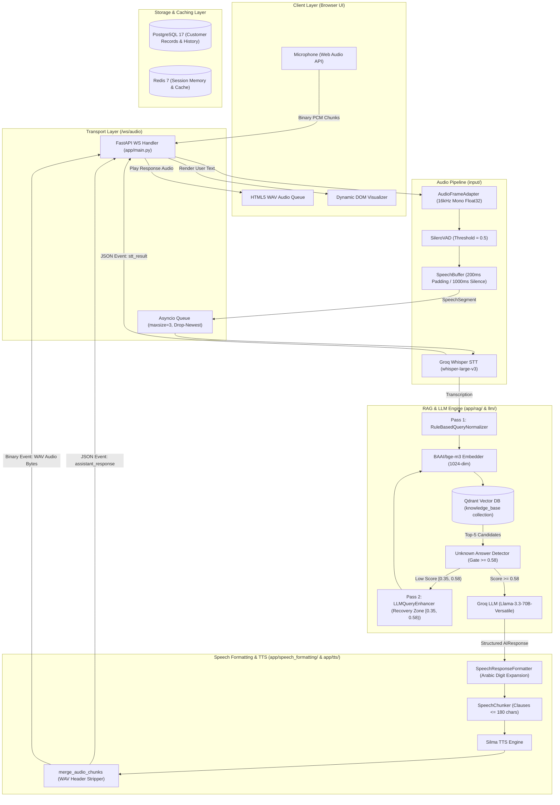
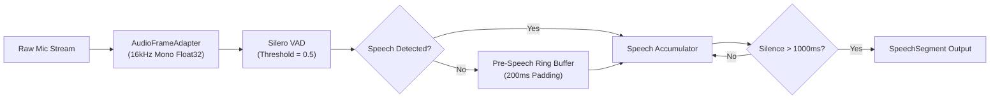
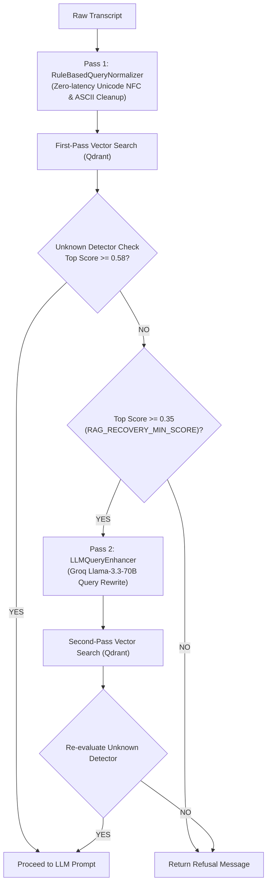
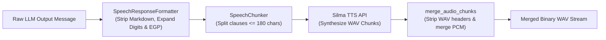

# System Architecture & Technical Design Documentation
## Multilingual Voice AI Customer Service Agent with RAG Pipeline

---

## TL;DR

### What is this project?
A multilingual Voice AI Customer Service Agent that enables real-time voice conversations using a production-oriented RAG pipeline.

### End-to-End Pipeline
```
Microphone
    ↓
Audio Adapter
    ↓
Silero VAD
    ↓
Speech Buffer
    ↓
Speech-to-Text (Groq Whisper)
    ↓
Query Optimization (Two-Pass)
    ↓
Embedding (BAAI/bge-m3)
    ↓
Qdrant Retrieval
    ↓
Unknown Detector (Score Gate >= 0.58)
    ↓
LLM (Groq Llama 3.3 70B)
    ↓
Speech Formatter
    ↓
Speech Chunker
    ↓
Silma TTS
    ↓
Browser Audio Response
```

### Core Technologies
- **Framework & Transport:** FastAPI, WebSockets, Uvicorn
- **Audio Processing & VAD:** Web Audio API, NumPy, Silero VAD (ONNX)
- **STT Engine:** Groq Whisper (`whisper-large-v3`), FasterWhisper (CTranslate2 fallback)
- **Embeddings & Vector Store:** `BAAI/bge-m3` (1024-dim), Qdrant v1.15.3
- **LLM Reasoning:** Groq API (`llama-3.3-70b-versatile`)
- **Speech Synthesis:** Silma TTS API, Regex Speech Formatter
- **Storage & Caching:** PostgreSQL 17, Redis 7

---

## 1. Project Overview

### Purpose
This project is an enterprise-grade, multilingual (Egyptian Arabic & English) **Voice AI Customer Service Agent**. It enables conversational voice interactions between customers and an automated customer service system for e-commerce and telecom domain inquiries.

### Problem Solved
Traditional call-center operations in Egypt face high turnover, rising staffing costs, and high Tier-1 call volumes. Traditional Interactive Voice Response (IVR) systems rely on keypress menus that alienate users. Existing text chatbots fail on Egyptian Arabic dialect (Ammiya) and English code-switching. Furthermore, generic voice AI agents suffer from multi-second latency, hallucinate non-existent corporate policies, and produce robotic audio outputs.

This system provides:
- **Real-Time Voice Streaming:** Bi-directional binary Web Audio streaming over WebSockets.
- **Accurate Dialect & Speech Recognition:** STT engine tuned for Egyptian Arabic and English terms using Groq Whisper / FasterWhisper.
- **Hallucination-Free Knowledge Grounding:** Two-pass RAG retrieval over Qdrant using dense multilingual `BAAI/bge-m3` embeddings and score-signal quality gating.
- **Natural Arabic Speech Synthesis:** Text normalization (expanding digits/currency) and clause-chunked synthesis via Silma TTS.

---

## 2. High-Level Architecture

The system follows Clean Layered Architecture with strict unidirectional data flow:



### Module Responsibilities & Layer Isolation
- **Input Pipeline (`input/`):** Normalizes multi-format incoming microphone PCM frames, runs frame-by-frame VAD inference, accumulates speech frames, and triggers STT transcription.
- **Orchestration Layer (`orchestration/`):** Manages flow execution between audio input, STT, RAG, and response synthesis while maintaining clean component state resets.
- **RAG & Reasoning (`app/rag/`, `llm/`):** Normalizes user queries, embeds text using BAAI/bge-m3, retrieves vector candidates from Qdrant, applies quality gating, triggers LLM recovery when appropriate, and constructs structured LLM prompts.
- **Speech & Output Layer (`app/speech_formatting/`, `app/tts/`):** Transforms raw LLM text outputs into spoken Arabic phrasing, chunks sentences, calls Silma TTS API, strips intermediate WAV headers, and sends merged WAV binary frames to the client.
- **Storage Infrastructure (`app/db/`):** PostgreSQL 17 persists relational customer profiles and ticket escalation records. Redis 7 caches short-lived session memory buffers.

---

## 3. Complete Request Lifecycle

```
1. User speaks into browser microphone (client/app.js).
   └─ Audio Context captures raw PCM audio in 32ms windows (512 samples at 16kHz).

2. Binary stream sent over WebSocket (/ws/audio).
   └─ app/main.py -> websocket_audio() converts int16/float32 byte stream to normalized NumPy array.

3. Audio Normalization & VAD Analysis.
   └─ input/adapter/audio_frame_adapter.py -> Normalizes array to [-1.0, 1.0].
   └─ input/vad/silero.py -> Silero VAD evaluates speech probability (Threshold: 0.5).

4. Utterance Buffer Assembly & Silence Cutoff.
   └─ input/buffer/speech_buffer.py -> Maintains 200ms pre-speech padding.
   └─ User pauses for >1000ms -> SpeechBuffer emits completed SpeechSegment.

5. Background Queue & STT Transcription.
   └─ Non-blocking push to asyncio.Queue(maxsize=3).
   └─ Worker calls GroqWhisperService (whisper-large-v3).
   └─ Emit stt_result JSON payload immediately to UI.

6. Two-Pass RAG Retrieval & Quality Gate.
   └─ Pass 1: RuleBasedQueryNormalizer cleans ASCII punctuation & applies NFC normalization.
   └─ EmbeddingService (BAAI/bge-m3) generates 1024-dim vector.
   └─ Qdrant retrieves Top-5 document chunks.
   └─ RuleBasedUnknownDetector evaluates top score:
        - If Top Score >= 0.58: Accept context directly.
        - If Top Score in [0.35, 0.58): Trigger LLMQueryEnhancer recovery rewrite and re-search Qdrant.
        - If Top Score < 0.35: Reject and return Arabic refusal message.

7. Structured LLM Generation.
   └─ Groq LLM (Llama-3.3-70b-versatile) generates structured JSON:
      AIResponse(action="RESPOND", department="SALES", message="...").

8. Speech Formatting & TTS Synthesis.
   └─ SpeechResponseFormatter removes Markdown tokens and converts digits to Arabic words.
   └─ SpeechChunker breaks text into segments <= 180 characters.
   └─ SilmaTTS synthesizes WAV audio chunks over HTTP POST.
   └─ merge_audio_chunks() strips intermediate 44-byte headers and concatenates PCM payloads.

9. Response Payload Emit & Browser Audio Playback.
   └─ Server emits assistant_response JSON, binary audio WAV bytes, and tts_finished event.
   └─ Client Web Audio Player plays response WAV and resets UI state to Idle.
```

---

## 4. Audio Pipeline



### Stage Responsibilities
1. **Audio Adapter (`input/adapter/audio_frame_adapter.py`):** Converts incoming multi-channel, non-16kHz, or integer PCM audio into a standardized float32 array normalized to `[-1.0, 1.0]`.
2. **Silero VAD (`input/vad/silero.py`):** Deep learning ONNX model evaluating frame-by-frame speech probability against `threshold = 0.5`.
3. **Speech Buffer (`input/buffer/speech_buffer.py`):** Maintains a 200ms ring buffer of historical audio to preserve initial consonants. Emits a `SpeechSegment` once trailing silence exceeds `max_silence_duration_ms = 1000ms`.

---

### 4.1 Resilience, Failure Modes & Fallback Matrix

| Failure Scenario | Root Cause | System Response & Fallback Path | User Impact |
|---|---|---|---|
| **Groq STT Outage / Rate Limit** | Cloud API 429/500 Error | `STT_FALLBACK_ENABLED=True` triggers local `FasterWhisperService` (CTranslate2). | Pipeline completes with ~400ms higher STT latency. |
| **Qdrant Vector DB Down** | Network drop / container crash | `UnknownAnswerDetector` triggers refusal path (`RAG_REFUSAL_MSG_AR`). | System politely admits lack of knowledge without crashing. |
| **Silma TTS Synthesis Failure** | HTTP 500 / API key error | Failsafe mode sets `has_audio=false` and emits `tts_failed` JSON frame. | UI renders text response in transcript; audio playback skipped. |
| **Client Disconnect Mid-Utterance** | WS socket drop / tab closed | Worker catches `WebSocketDisconnect`, cancels background task, and drains queue. | Resources freed immediately; no dangling tasks. |

---

### 4.2 Observability & Latency Profiling Metrics

Per-stage execution latencies are tracked and recorded in `RagDebugInfo` for real-time observability:

```python
latencies_ms = {
    "normalization": round(t_norm_ms, 2),    # Pass 1 Rule-based normalizer latency (<0.1ms)
    "translation":   round(t_trans_ms, 2),   # Optional query translation latency
    "retrieval":     round(t_retrieval_ms, 2), # BGE-M3 embedding + Qdrant search latency (~25ms)
    "enhancement":   round(t_enhance_ms, 2),  # Pass 2 LLM rewrite latency if triggered (~300ms)
    "detection":     round(t_detect_ms, 2),   # Unknown detector signal evaluation (<0.1ms)
    "generation":    round(t_gen_ms, 2),      # Groq Llama-3.3-70B completion latency (~400ms)
    "total":         round(t_total_ms, 2),    # Total RAG pipeline turnaround time
}
```

---

## 5. Speech-to-Text (STT) Layer

### Model & Provider Configuration
- **Primary Engine:** `GroqWhisperService` utilizing Groq API running `whisper-large-v3`.
- **Fallback Engine:** `FasterWhisperService` running local CTranslate2 (`whisper-medium` / `whisper-small`). Enabled via `STT_FALLBACK_ENABLED = True`.
- **Output Schema:** `Transcription(text: str, language: str, start_timestamp: float, end_timestamp: float)`.
- **Latency Target:** ~200ms - 350ms via Groq Whisper API.

---

## 6. Query Optimization Layer

The query optimization subsystem (`app/query_optimization/`) employs a **Hybrid Two-Pass Architecture**:



### Pass 1: `RuleBasedQueryNormalizer`
- **Execution:** Fast, deterministic (<0.1ms).
- **Operations:** Applies Unicode NFC normalization, strips safe ASCII punctuation, and collapses whitespace. Preserves Arabic characters and query language.

### Pass 2: `LLMQueryEnhancer` (Recovery Pass)
- **Trigger Condition:** Executed only when Pass 1 top similarity score falls in the low-confidence window `[0.35, 0.58)`.
- **Function:** Rewrites conversational or dialectal user queries into keyword-dense search strings.
- **Example:**
  - *Input:* `"ايه هي مصاريف السحب من فيزا جولد"`
  - *Output:* `"Gold Credit Card fees charges cash withdrawal limit مصاريف بطاقة جولد"`

---

## 7. Embedding Layer

- **Model:** `BAAI/bge-m3` loaded via `SentenceTransformers`.
- **Vector Dimension:** 1024-dimensional dense vectors.
- **Rationale:** `BAAI/bge-m3` provides multi-linguality and representation for Egyptian Arabic, English, and code-switched queries without external API overhead.

---

## 8. Retrieval Layer

- **Vector Store:** Qdrant v1.15.3.
- **Collection Name:** `knowledge_base`.
- **Distance Metric:** Cosine Similarity.
- **Top-K:** `RAG_TOP_K = 5` candidate chunks per search.
- **Search Execution:** `RetrievalService` executes dense ANN search over Qdrant and orders results by score descending, assigning 1-based ranks.

---

## 9. Unknown Answer Detector & Threshold Gating

The `RuleBasedUnknownDetector` (`app/unknown_detection/rule_based.py`) acts as a quality gate to prevent model hallucinations:

### Signal Evaluation Chain (Short-Circuits on First Failure)
1. **Empty Check:** `not results` $\rightarrow$ `EMPTY_RESULTS` rejection.
2. **Min Results Check:** `len(results) < UNKNOWN_DETECTOR_MIN_RESULTS (1)` $\rightarrow$ `INSUFFICIENT_RESULTS` rejection.
3. **Top Score Check:** `top_score < UNKNOWN_DETECTOR_MIN_SCORE (0.58)` $\rightarrow$ `LOW_TOP_SCORE` rejection.
4. **Mean Score Check:** `avg_score < UNKNOWN_DETECTOR_MEAN_THRESHOLD (0.50)` $\rightarrow$ `LOW_MEAN_SCORE` rejection.

---

## 10. RAG Pipeline

1. **Context Building (`app/rag/builders/context_builder.py`):** Formats retrieved Qdrant document chunks into a formatted text block bounded by `RAG_MAX_CONTEXT_CHARS = 4000`.
2. **Prompt Construction (`app/rag/builders/prompt_builder.py`):** Injects user question and context block into system prompt templates.
3. **LLM Execution (`llm/rag_llm.py`):** Submits prompt to Groq LLM API and parses structured response.

---

## 11. LLM Layer

- **Model:** `llama-3.3-70b-versatile` hosted on Groq API.
- **Temperature:** `0.1` (Deterministic).
- **Max Output Tokens:** `350`.
- **Output Schema:** Pydantic `AIResponse` model (`action`, `department`, `reason`, `message`, `language`).

---

## 12. Speech Generation Layer



### Key Utilities
- **Formatter (`app/speech_formatting/formatter.py`):** Converts numeric digits (`150`) to written Arabic words (`مائة وخمسون`), expands currency tokens (`EGP` $\rightarrow$ `جنيه مصري`), and strips Markdown formatting (`**`, `#`).
- **Chunker (`app/speech_formatting/chunker.py`):** Splits text into clause-aligned strings under `TTS_MAX_CHUNK_LENGTH = 180` characters.
- **Audio Merger (`app/tts/audio_utils.py`):** Extracts raw PCM payload from multiple WAV chunks, recalculates byte length fields, and prepends a single 44-byte WAV header.

---

## 13. System Configuration & Threshold Index

All configuration settings are managed via Pydantic Settings in `app/config/settings.py`:

| Parameter Name | Value | Unit | Env Var Override Key | Purpose & Governance |
|---|---|---|---|---|
| `PIPELINE_SAMPLE_RATE` | `16000` | Hz | Immutable Constant | Canonical audio sampling frequency for Silero VAD & Whisper. |
| `PIPELINE_CHANNELS` | `1` | Count | Immutable Constant | Audio channel count (Mono). |
| `UNKNOWN_DETECTOR_MIN_SCORE` | `0.58` | Cosine Ratio | `UNKNOWN_DETECTOR_MIN_SCORE` | Minimum top-1 similarity score gate below which context is rejected. |
| `UNKNOWN_DETECTOR_MIN_RESULTS` | `1` | Count | `UNKNOWN_DETECTOR_MIN_RESULTS` | Minimum required result count. |
| `UNKNOWN_DETECTOR_MEAN_THRESHOLD` | `0.50` | Cosine Ratio | `UNKNOWN_DETECTOR_MEAN_THRESHOLD` | Minimum average similarity score across candidate cluster. |
| `RAG_RECOVERY_MIN_SCORE` | `0.35` | Cosine Ratio | `RAG_RECOVERY_MIN_SCORE` | Score threshold to trigger Pass-2 LLM query enhancement. |
| `RAG_TOP_K` | `5` | Count | `RAG_TOP_K` | Number of document chunks retrieved from Qdrant per search. |
| `RAG_MAX_CONTEXT_CHARS` | `4000` | Characters | `RAG_MAX_CONTEXT_CHARS` | Maximum character length of RAG context. |
| `TTS_MAX_CHUNK_LENGTH` | `180` | Characters | `TTS_MAX_CHUNK_LENGTH` | Maximum character string length per TTS chunk. |
| `EMBEDDING_MODEL` | `"BAAI/bge-m3"` | Model ID | `EMBEDDING_MODEL` | SentenceTransformers embedding model (1024 dimensions). |
| `GROQ_MODEL` | `"llama-3.3-70b-versatile"` | Model ID | `GROQ_MODEL` | Primary LLM inference model. |
| `STT_PROVIDER` | `"groq"` | Enum | `STT_PROVIDER` | Speech-to-text provider (`"groq"` / `"local"`). |

---

## 14. Repository Folder Map

- `app/`: Primary FastAPI infrastructure, config, database helpers, RAG pipeline, speech formatting, and TTS.
- `input/`: Audio pipeline (sources, adapter, Silero VAD, speech buffer, STT engines).
- `orchestration/`: Async orchestrator coordinating pipeline stages and resets.
- `llm/`: Base LLM interfaces, Groq/Ollama implementations, prompts, and Pydantic schemas.
- `client/`: Browser Web Audio API driver, UI controller (`app.js`), layout (`index.html`, `style.css`).
- `data/`: Raw seed knowledge base JSON documents.
- `storage/`: Persistent Docker volume mounts (PostgreSQL, Redis, Qdrant).

---

## 15. Architectural Design Decisions

1. **Clean Layered Architecture:** Decouples audio processing from AI models, allowing STT, LLM, or TTS providers to be swapped via interfaces without modifying business logic.
2. **Two-Pass RAG Search:** Combines fast deterministic normalization (<0.1ms) with conditional LLM query rewriting for low-confidence queries, optimizing both latency and API cost.
3. **Structured Pydantic LLM Output:** Forces LLM responses into typed `AIResponse` schemas, enabling downstream automation (e.g. `action = "ESCALATE"`).

---

## 16. Performance & Latency Metrics

| Pipeline Stage | Target Latency | Performance Characteristics |
|---|---|---|
| Framing & VAD | ~2ms | Real-time NumPy tensor evaluation. |
| Silence Endpointing | 1000ms | SpeechBuffer pause detection window. |
| Groq Whisper STT | ~200ms - 350ms | Cloud API inference latency. |
| Qdrant Vector Search | ~15ms - 30ms | ANN Cosine similarity search. |
| Groq Llama-3.3-70B LLM | ~350ms - 500ms | Cloud LLM inference latency. |
| Speech Normalization | ~3ms | Regex digit-to-words & token conversion. |
| Silma TTS Generation | ~250ms - 400ms | Chunked synthesis over HTTP POST. |
| **Total Turnaround** | **~1.8s - 2.3s** | **Silence cutoff to first audio playback byte.** |

---

## 17. Engineering Tradeoffs

### 1. WebSockets vs WebRTC
- **Pros:** WebSockets simplify bi-directional PCM audio streaming and JSON message multiplexing over a single TCP connection.
- **Cons:** Higher transport latency than UDP-based WebRTC under poor network conditions.

### 2. Cloud Groq APIs vs Local Models
- **Pros:** Sub-500ms latency for 70B LLM and Whisper Large v3 without requiring expensive local GPU infrastructure.
- **Cons:** Requires external network access and API subscription keys.

---

## 18. Future Production Improvements

1. **Hybrid Vector Search:** Combine BAAI/bge-m3 dense embeddings with BM25 sparse keyword search and Reciprocal Rank Fusion (RRF) in Qdrant.
2. **Streaming TTS Audio:** Implement chunked WebSockets streaming for TTS audio frames to allow playback while downstream text chunks are still synthesizing.
3. **Client-Side Barge-In:** Immediately cancel server worker tasks and halt audio playback when client-side VAD detects new user speech.

---

## 19. Quick Interview & Defense Review Notes

#### Q: How does the system handle dialectal Egyptian Arabic?
**A:** Via `BAAI/bge-m3` dense embeddings and the Pass 2 `LLMQueryEnhancer`, which maps colloquial terms (e.g. `"فيزا"`, `"بكام"`) into standard domain keywords (`"Credit Card"`, `"fees charges"`).

#### Q: How are hallucinations prevented when knowledge is missing?
**A:** The `RuleBasedUnknownDetector` checks retrieved Qdrant chunks against `UNKNOWN_DETECTOR_MIN_SCORE = 0.58`. If top-1 similarity falls below 0.58, context is rejected and an Arabic refusal message is returned.

#### Q: Why is raw WAV concatenation inadequate for TTS chunks?
**A:** Direct byte concatenation leaves intermediate 44-byte WAV headers inside the audio stream, causing audio clicks and player crashes. `merge_audio_chunks()` strips inner headers and recalculates total PCM data sizes in a single canonical header.
